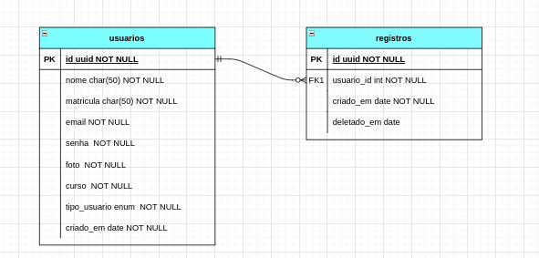

## Projeto Hoolhoja - Em construção
Esse projeto é uma api simples para controlar o sistema de entrada e saída de alunos do Laboratório de Práticas Autônomas do IFTO. O que antes era registrado em caderno, agora poderá ser
registrado por meio de um sistema em um banco de dados.

### Modelo do banco de dados


### Tecnologias utilizadas
- NodeJS
- TypeScript
- JWT
- Multer
- TypeORM
- NestJS
- MySQL

## Installation

```bash
$ npm install
```

## Running the app

```bash
# development
$ npm run start

# watch mode
$ npm run start:dev

# production mode
$ npm run start:prod
```

## Test

```bash
# unit tests
$ npm run test

# e2e tests
$ npm run test:e2e

# test coverage
$ npm run test:cov
```

